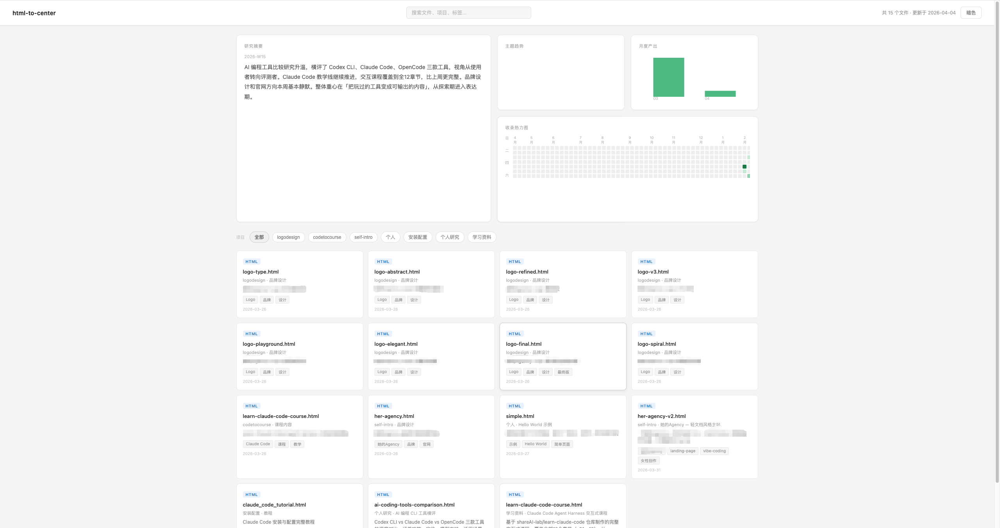

# html-to-center

一个 Claude Code Skill，把你散落在各个项目目录下的 HTML 文件，汇聚成一个有温度的个人产出中心。

*A Claude Code skill that turns your scattered HTML files into a personal output center — with a beautiful dashboard, smart tagging, and weekly research insights.*

---

## 痛点 / The Problem

Vibe Coding 正在改变我们的工作方式。越来越多人开始用 Claude Code 生成 HTML 来替代传统文档——一份竞品分析不再是 Word，而是一个有交互、有动效的独立网页；一次汇报不再是 PPT，而是一个可以直接打开的精美 HTML；一个技术 Demo 不再需要部署，直接双击就能看。

HTML 正在成为新时代的文档格式。它比 Word 更美，比 PPT 更灵活，比 PDF 更有生命力。

但随着产出越来越多，一个新问题出现了：**这些文件散落在不同项目目录里，没有索引，没有上下文，靠记忆寻找。** 你记得做过一份关于 RAG 的分析，但不记得放在哪个项目下。你想找上次的投资人材料，翻了五个目录才找到。更多时候，你甚至忘了自己做过某件事。

没有全局视图。没有归档习惯。只有一堆你半记得的文件名。

**html-to-center 解决这个问题。**

---

*Vibe Coding is changing how we work. More and more people are using Claude Code to generate HTML instead of traditional documents — a competitive analysis becomes an interactive webpage, a presentation becomes a self-contained HTML file, a demo works right out of the box with a double-click.*

*HTML is becoming the document format of the new era. More beautiful than Word, more flexible than PowerPoint, more alive than PDF.*

*But as output grows, a new problem emerges: these files are scattered across different project directories, with no index, no context, found only by memory. You remember writing a RAG analysis somewhere, but not which project folder. You look for last month's pitch deck and dig through five directories. More often, you forget you made something at all.*

*No overview. No archiving habit. Just files you half-remember.*

*html-to-center solves this.*

---

## 它能做什么 / What It Does

每次生成 HTML 文件后，Skill 自动弹出收录提示，Claude 基于当前上下文推断项目名、主题、描述和标签，一键确认即可存档。

随时打开 Dashboard，一眼看清你的全局产出：

- **研究摘要** — 每周由 Claude 自动生成，无需 API Key，无需任何配置
- **主题趋势** — 哪些方向在升温，哪些在降温
- **收录热力图** — 你的产出日历，GitHub 风格
- **月度产出** — 近半年的产出节奏
- **项目活跃度** — 哪些项目还在跑，哪些已经沉寂
- **文件卡片** — 可搜索、可过滤、点击直接打开

亮色 / 暗色主题，记住你的偏好。

*Every time you generate an HTML file, the skill automatically asks if you want to register it. Claude infers the project name, topic, description, and tags from context — one keypress to log it.*

*Open your dashboard at any time:*

- *Research summary — auto-generated weekly by Claude, no API key needed*
- *Topic trends — which areas are heating up or cooling down*
- *Activity heatmap — your output calendar, GitHub-style*
- *Monthly output — your productivity over time*
- *Project activity — which projects are active vs dormant*
- *File cards — searchable, filterable, clickable to open*

*Light and dark themes. Remembers your preference.*

---

## 安装 / Installation

**1. 克隆到 Claude Code 的 skills 目录：**

```bash
git clone https://github.com/tngt/html-to-center ~/.claude/skills/html-to-center
```

**2. 首次使用，直接说：**

```
帮我初始化 html-to-center
# or in English:
Initialize html-to-center for me
```

Claude 会引导你配置项目根目录，自动扫描已有文件批量导入，并在 `~/.claude/settings.json` 中安装一个 PostToolUse Hook——此后每次生成 `.html` 文件，都会自动触发收录提示，无需手动调用。

*Claude will ask for your project root directory and set everything up, including scanning existing files for bulk import. It also installs a PostToolUse hook in `~/.claude/settings.json` so every future `.html` file automatically triggers a registration prompt — no manual invocation needed.*

---

## 日常使用 / Daily Usage

**生成任意 HTML 文件后 / After generating any HTML file:**

```
已生成 `competitive-analysis.html`
项目：AI工具研究
主题：竞品分析
描述：DeepSeek vs GPT-4 综合对比报告

收录到 center？[Y/n]
```

**打开 Dashboard / Open dashboard:**
```
打开我的 center  /  Open my center
```

**查找文件 / Find a file:**
```
我之前做过竞品分析，帮我找一下
Find my competitive analysis reports
```

**修改或移除 / Edit or remove:**
```
把这个文件的标签改一下  /  Update the tags for this file
从 center 移除这个文件  /  Remove this file from center
```

---

## Dashboard



Dashboard 是一个纯静态 HTML 文件，本地用 `file://` 直接打开，无需服务器。也支持部署到 GitHub Pages。

*The dashboard is a self-contained HTML file. Works locally with no server needed. Deployable to GitHub Pages.*

**功能 / Features:**
- 全文搜索（文件名、项目、主题、标签）/ Full-text search
- 按项目过滤 / Filter by project
- 点击卡片直接打开文件 / Click to open files
- 亮色 / 暗色主题切换 / Light & dark theme toggle
- URL Hash 过滤 / URL hash filter (`#filter=keyword`)

**每周研究摘要**由 Claude 在你每周首次打开 Dashboard 时自动生成，无 API Key，无 Cron，无额外配置。

*Weekly research summary is auto-generated by Claude on your first dashboard open each week — no API key, no cron job, no setup.*

---

## 目录结构 / File Structure

```
html-to-center/
├── SKILL.md                    # Skill 定义与路由逻辑 / Skill definition
├── scripts/
│   ├── scan.py                 # 扫描项目目录 / Scan project root
│   ├── register.py             # 读写 registry / Read & write registry
│   ├── generate_dashboard.py   # 生成 Dashboard / Generate dashboard HTML
│   └── deploy.py               # 部署到 GitHub Pages / Deploy to GitHub Pages
└── references/
    ├── registry-schema.md      # 数据结构文档 / Data structure docs
    └── dashboard-design.md     # Dashboard 设计规范 / Design spec
```

**配置文件 / Config** (`~/.config/html-to-center/config.json`):

```json
{
  "center_dir": "/path/to/your/center",
  "root": "/path/to/your/projects",
  "github_pages_repo": "https://github.com/you/center"
}
```

---

## GitHub Pages 部署 / Deployment

> **注意 / Note:** 私有仓库的 GitHub Pages 需要 GitHub Pro / Team / Enterprise 账号。免费账号部署的 Dashboard 将公开可见。
> *Private GitHub Pages requires a paid GitHub plan. Free accounts will have a public dashboard.*

```
把我的 center 部署到 GitHub Pages
# or:
python3 ~/.claude/skills/html-to-center/scripts/deploy.py
```

---

## 依赖 / Requirements

- Claude Code
- Python 3.8+
- 仅用标准库，无需安装任何包 / Standard library only, no pip installs

---

## 设计理念 / Philosophy

**记录一件事最好的时机，是你刚刚做完它的那一刻。**

Claude 生成文件时已经知道这是什么、为什么做。把这个上下文捕捉下来只需要一次回车。六个月后，当你想找回当时的某份分析报告，你会庆幸留下了这一步。

Dashboard 不只是文件浏览器。它是你思维的镜子——告诉你这段时间在关注什么，研究的重心在哪里。

*The best time to log something is the moment you make it.*

*Claude already knows what you just built and why. Capturing that context costs one keypress. The dashboard isn't just a file browser — it's a mirror of your thinking, showing you what you've been working on and where your research is heading.*
